# Onyx Auto: End-to-End Used Car Dealership Analytics Engineering Platform

Onyx Auto is an end-to-end analytics engineering project that simulates a used car dealership data platform. Operational records such as vehicle inventory updates, customer records, vendor records, parts orders, and sales transactions are entered through a PHP frontend and stored in a MySQL transactional database. Airbyte syncs the operational MySQL data into Snowflake, dbt transforms the warehouse data through staging, intermediate, and mart layers, Power BI consumes the final mart models for dealership reporting, and Airflow orchestrates the daily refresh workflow.

This project was built to demonstrate how raw operational dealership data can be captured, ingested, transformed, modeled, orchestrated, and delivered as business-ready reporting through a modern analytics engineering stack.

---

## Tech Stack

- **Frontend application:** PHP
- **Transactional database:** MySQL
- **Data ingestion:** Airbyte
- **Warehouse:** Snowflake
- **Transformation framework:** dbt
- **Modeling pattern:** Medallion-style architecture with staging, intermediate, and mart layers
- **Reporting layer:** Power BI
- **Orchestration:** Apache Airflow
- **Runtime environment:** Docker and Docker Compose
- **Alerting:** Microsoft Teams webhook alerts from Airflow failure callbacks

---

## Architecture Overview

The Onyx Auto platform follows a source-to-dashboard analytics workflow. The PHP application captures dealership activity and writes records into MySQL. Airbyte syncs the MySQL source tables into Snowflake, where the raw data lands in a dedicated raw database and schema. dbt then transforms the raw data into clean analytical models. Power BI connects to the final mart models in Snowflake to provide the business-facing reporting layer. Airflow coordinates the workflow so ingestion, transformation, and reporting refresh tasks run in the correct order.

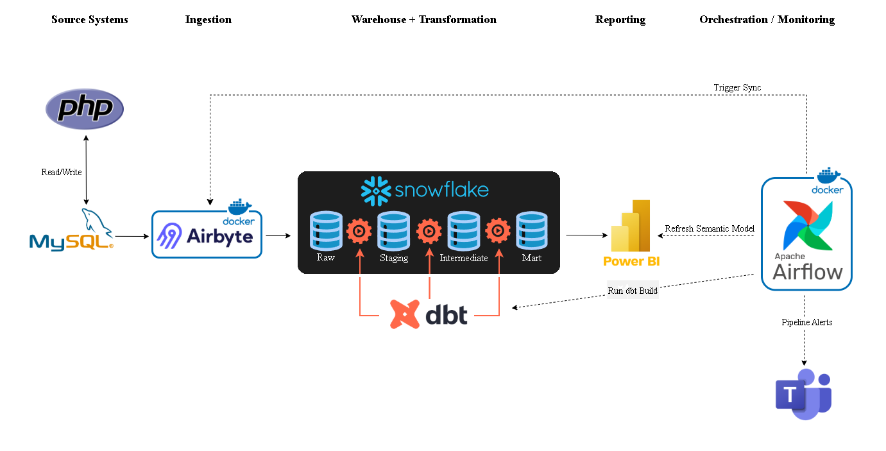

**Figure 1:** End-to-end Onyx Auto architecture showing dealership data moving from the PHP frontend and MySQL transactional database into Snowflake through Airbyte, transformed with dbt across raw, staging, intermediate, and mart layers, consumed by Power BI, and orchestrated through Airflow with Teams-based pipeline alerts.

### Data Flow

1. Dealership users enter operational data through the PHP frontend.
2. MySQL stores the operational records as the transactional source system.
3. Airbyte syncs MySQL tables into the Snowflake raw landing schema.
4. dbt transforms the raw Snowflake data into staging, intermediate, and mart models.
5. Power BI connects to the final Snowflake mart models for reporting.
6. Airflow runs the pipeline on a schedule and coordinates each dependency.
7. Microsoft Teams receives failure alerts if a pipeline task fails.

---

## Business Problem

Used car dealerships need visibility into inventory, sales, parts activity, seller quality, and operational performance. Raw transactional systems are useful for recording day-to-day activity, but they are not always designed for analytical reporting. This project models how a dealership can move from operational data capture to structured reporting.

The reporting layer supports questions such as:

- How much net income and gross sales income has the dealership generated?
- Which vehicle types contribute the most income?
- How many vehicles are currently active in inventory?
- How long are vehicles remaining unsold?
- Which sales agents are driving monthly performance?
- Which vendors are associated with the highest parts activity?
- Which sellers are associated with higher downstream parts costs?

The project is framed as an analytics engineering system because the main objective is not only to store data or build a dashboard. The objective is to design the full pipeline that turns dealership operational records into reliable reporting models.

---

## Source Application and Transactional Database

The source system is a PHP dealership application backed by a MySQL transactional database. The application supports operational workflows such as user login, customer management, vendor management, vehicle search, vehicle inventory entry, parts order creation, sales processing, vehicle status updates, and operational report generation.

The information flow design includes application forms and reporting flows for login, customer entry, vehicle search, vendor entry, vehicle detail review, adding vehicles to inventory, parts orders, sales transactions, monthly sales reporting, seller history reporting, price-per-condition reporting, parts statistics reporting, and average time in inventory reporting.

The MySQL schema models dealership operations around users, employee roles, customers, vehicles, manufacturers, vehicle types, vendors, sales, vehicle colors, parts orders, and part line items. Vehicles are keyed by VIN. Sales are stored in a separate `Sale` table so unsold vehicles can remain in inventory without requiring null sale-related fields.

### Core Source Tables

- `User`
- `AcquisitionSpecialist`
- `SalesAgent`
- `OperatingManager`
- `Customer`
- `Individual`
- `Business`
- `Vehicle`
- `VehicleType`
- `Manufacturer`
- `Vendor`
- `Sale`
- `VehicleColor`
- `PartsOrder`
- `Part`

### Database Design Artifacts

- Information flow diagram: `app/php-frontend/ifd_diagram.pdf`
- Extended entity relationship diagram: `docs/database-design/eer_diagram.pdf`
- Relational schema: `database/relational_schema.sql`

---

## Airbyte Ingestion Layer

Airbyte is used to move operational data from MySQL into Snowflake. The Airbyte connection syncs MySQL streams that represent dealership entities such as customers, vehicles, sales, parts orders, vendors, manufacturers, users, and employee role tables.

The Snowflake destination lands raw source data in:

```text
DEALERSHIP_RAW.MYSQL_LOAD
```

This schema acts as the raw landing zone for MySQL data before dbt applies downstream transformations. The Airbyte connection uses an incremental append-and-deduplicate sync pattern. All streams use an `updated_at` field to identify changed records during syncs.

### Airbyte Screenshots

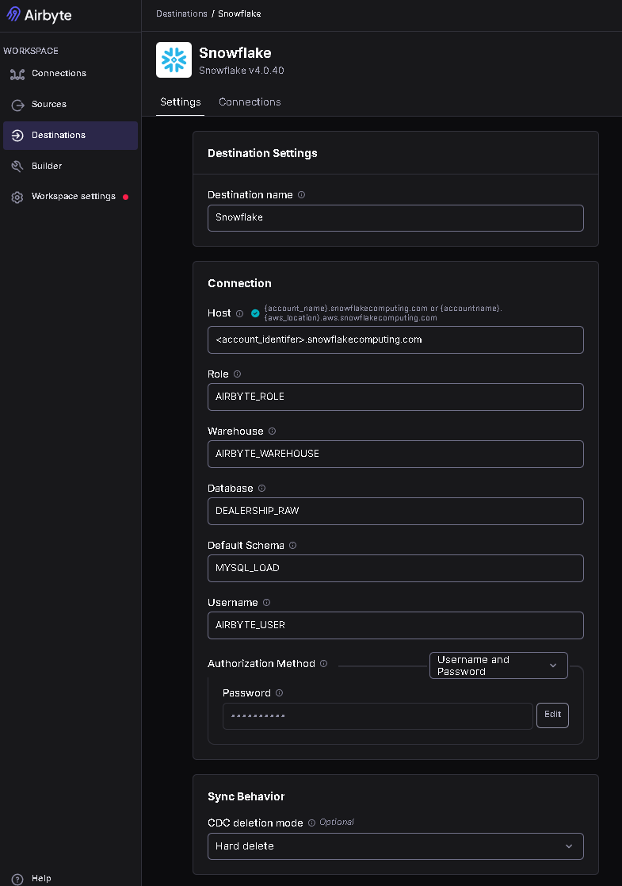

**Figure 2:** Airbyte Snowflake destination configuration showing the raw data landing location as `DEALERSHIP_RAW.MYSQL_LOAD`.

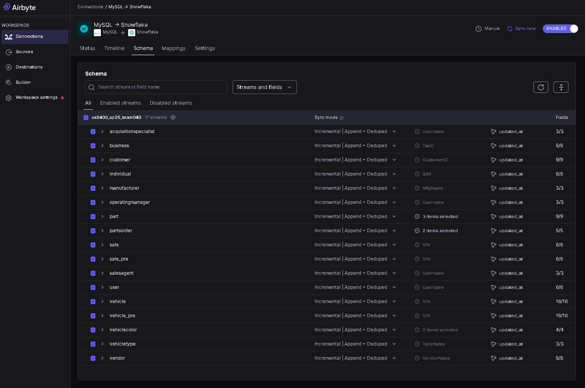

**Figure 3:** Airbyte MySQL-to-Snowflake schema configuration showing enabled source streams synced with an incremental append-and-deduplicate pattern.

---

## Snowflake Warehouse Design

Snowflake serves as the central analytical warehouse for the project. The warehouse is organized into separate raw and analytics areas so ingested source data remains separate from transformed reporting models.

Airbyte lands MySQL source data in:

```text
DEALERSHIP_RAW.MYSQL_LOAD
```

dbt builds transformed models in:

```text
DEALERSHIP_ANALYTICS.STAGING
DEALERSHIP_ANALYTICS.INTERMEDIATE
DEALERSHIP_ANALYTICS.MARTS
```

The Snowflake setup also separates tool permissions by responsibility. `AIRBYTE_ROLE` is used for ingestion into the raw landing schema. `DBT_ROLE` is used to read from the raw layer and build models in the analytics schemas.

The warehouse is configured as an `XSMALL` warehouse with auto-suspend and auto-resume enabled, which is appropriate for a controlled portfolio project and development workload.

---

## dbt Transformation Layer

The dbt project, `dealership_data`, transforms Airbyte-loaded MySQL data in Snowflake into analytics-ready dealership models. The project uses a medallion-style structure with staging, intermediate, and mart layers.

### dbt Project Configuration

- Project name: `dealership_data`
- Profile name: `dealership_analytics`
- Model path: `models/`
- Staging schema: `STAGING`
- Intermediate schema: `INTERMEDIATE`
- Mart schema: `MARTS`

The materialization strategy is intentional:

- **Staging models** are materialized as views in the `STAGING` schema.
- **Intermediate models** are materialized as views in the `INTERMEDIATE` schema.
- **Mart models** are materialized as tables in the `MARTS` schema.

This design keeps the early transformation layers lightweight while making the final reporting models stable for Power BI consumption.

### Staging Layer

The staging layer standardizes the raw Airbyte-loaded MySQL source tables. These models map closely to the source system and provide a clean foundation for downstream business logic.

Staging models include:

```text
stg_acquisition_specialist
stg_business
stg_customer
stg_individual
stg_manufacturer
stg_operating_manager
stg_part
stg_parts_order
stg_sale
stg_sales_agent
stg_user
stg_vehicle
stg_vehicle_color
stg_vehicle_type
stg_vendor
```

The dbt source file defines `mysql_load` as the Airbyte-loaded MySQL operational source in `DEALERSHIP_RAW.MYSQL_LOAD`. Source-level tests are included for important identifiers such as customer IDs, VINs, and sale VINs.

### Intermediate Layer

The intermediate layer applies reusable business logic between staging and marts. These models combine and enrich dealership entities before final reporting models are created.

Intermediate models include:

```text
int_customer_unified
int_employee_roles
int_sales_enriched
int_vehicle_color_rollup
int_vehicle_financials
int_vehicle_parts_costs
int_vehicle_status
```

This layer prepares reusable logic for unified customers, employee roles, enriched sales, vehicle colors, vehicle financials, parts costs, and vehicle status.

### Mart Layer

The mart layer contains the final reporting-ready models consumed by Power BI. The mart layer includes dimensions, facts, and aggregate models.

Dimension models:

```text
dim_customer
dim_date
dim_employee
dim_vehicle
dim_vendor
```

Fact models:

```text
fact_parts
fact_sales
fact_vehicle_lifecycle
```

Aggregate models:

```text
agg_avg_time_inventory
agg_monthly_sales
agg_monthly_sales_agent
agg_price_per_condition
agg_seller_history
agg_vendor_parts
```

The mart YAML file documents the reporting models and includes dbt tests for uniqueness, non-null constraints, and relationships between fact and dimension models.

### dbt Lineage

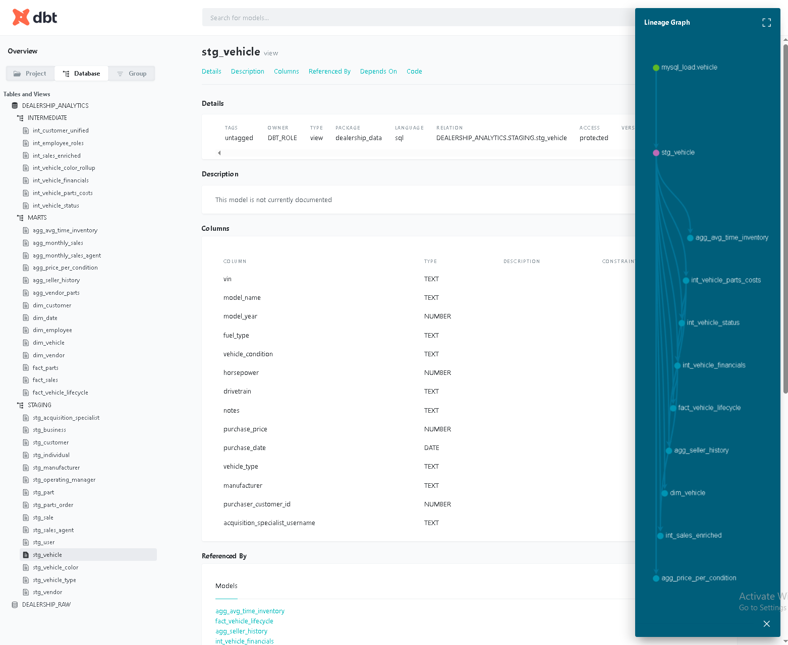

**Figure 4:** dbt lineage view showing how source tables flow through staging, intermediate, and mart models.

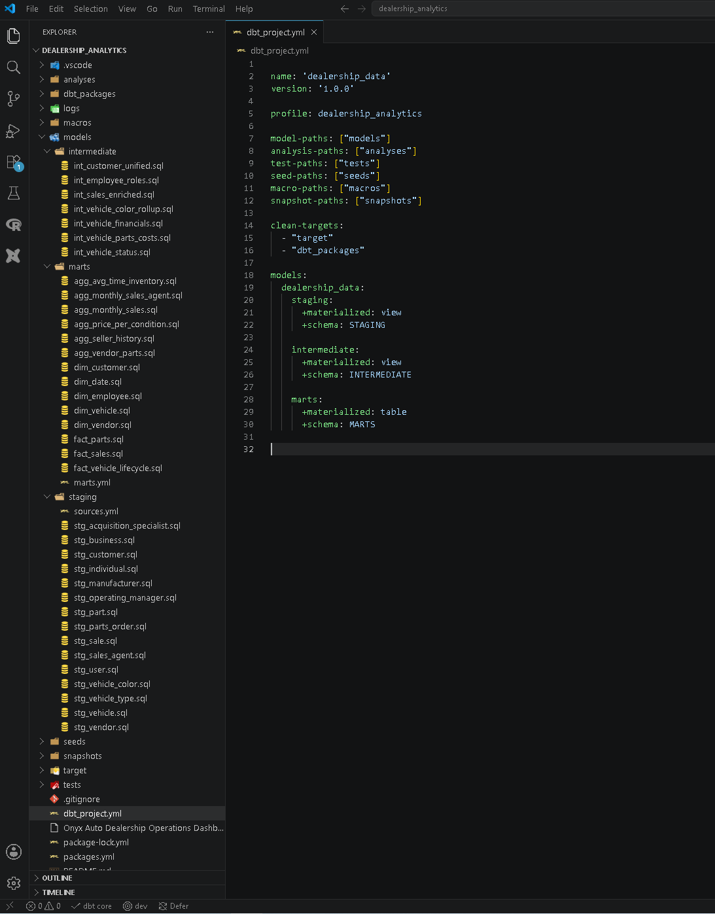

**Figure 5:** dbt model overview showing the project structure across transformation layers.

---

## Power BI Reporting Layer

Power BI serves as the final consumption layer for the Onyx Auto analytics platform. The report connects to curated Snowflake mart models built with dbt and presents dealership performance through multiple business-focused report pages.

### Executive Dashboard Overview

The executive overview page summarizes dealership performance across net income, gross margin, gross sales income, vehicles sold, average profit per vehicle, and average days in inventory. Supporting visuals show monthly net income trends, net income by vehicle type, vehicle-level transaction details, and inventory aging.

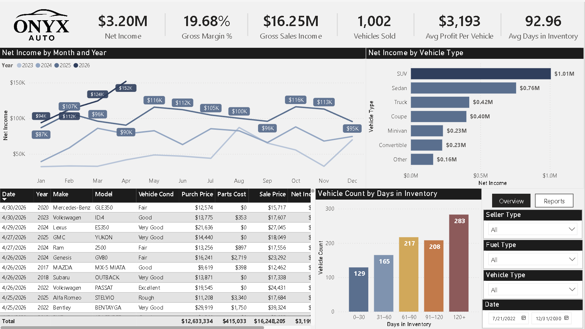

**Figure 6:** Executive overview dashboard showing dealership performance across net income, gross margin, gross sales income, vehicles sold, average profit per vehicle, and average days in inventory.

### Monthly Sales Report

The monthly sales page provides year-to-date sales performance and monthly drilldown analysis. Users can review net income, gross sales, vehicles sold, profit per vehicle, and sales-agent-level net income performance.

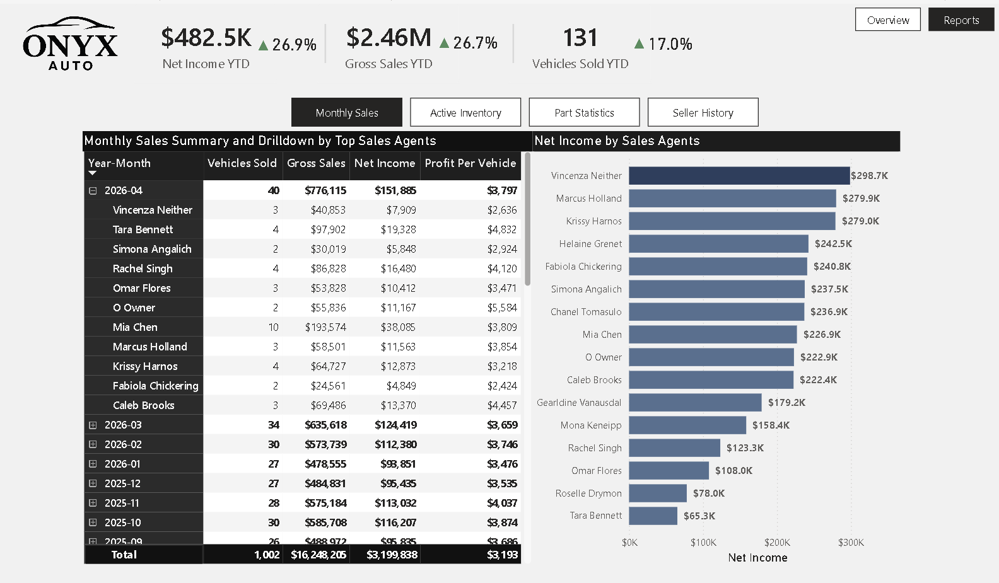

**Figure 7:** Monthly sales report showing year-to-date net income, gross sales, vehicles sold, monthly sales drilldowns, and sales-agent-level net income performance.

### Active Inventory Report

The active inventory page focuses on unsold vehicle inventory and operational inventory health. It tracks vehicles currently in inventory, total inventory value, average days in inventory for unsold vehicles, percentage of unsold vehicles over 60 days, and inventory turnover rate.

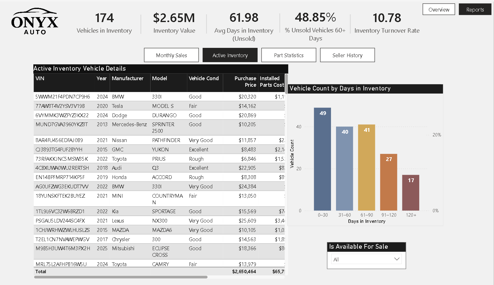

**Figure 8:** Active inventory report showing current inventory count, inventory value, average unsold days in inventory, percentage of unsold vehicles over 60 days, inventory turnover rate, and vehicle-level inventory details.

### Part Statistics Report

The part statistics page analyzes dealership parts activity across vendors, orders, supplied parts, vehicles serviced, total spend, and average part cost. This adds operational visibility into parts procurement and service-related costs.

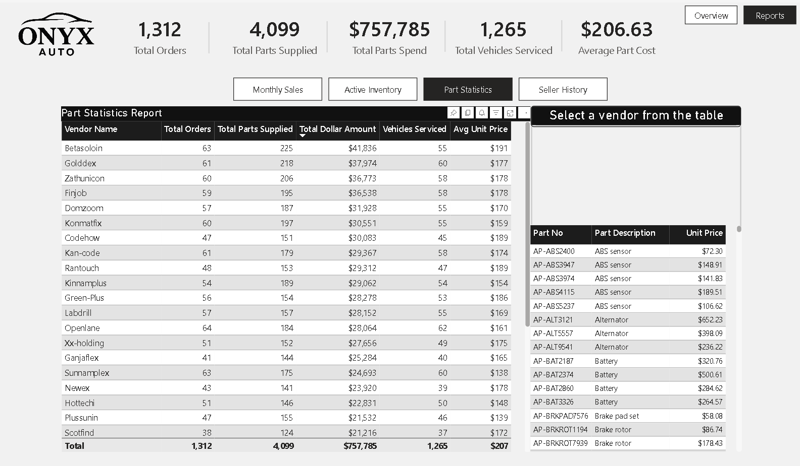

**Figure 9:** Part statistics report showing total parts orders, parts supplied, parts spend, vehicles serviced, average part cost, vendor-level part activity, and part-level detail drilldowns.

### Seller History Report

The seller history page identifies sellers associated with higher downstream parts costs and vehicle reconditioning activity. This page highlights high-risk sellers, high-risk purchased vehicles, parts installed per vehicle, and parts cost per high-risk vehicle.

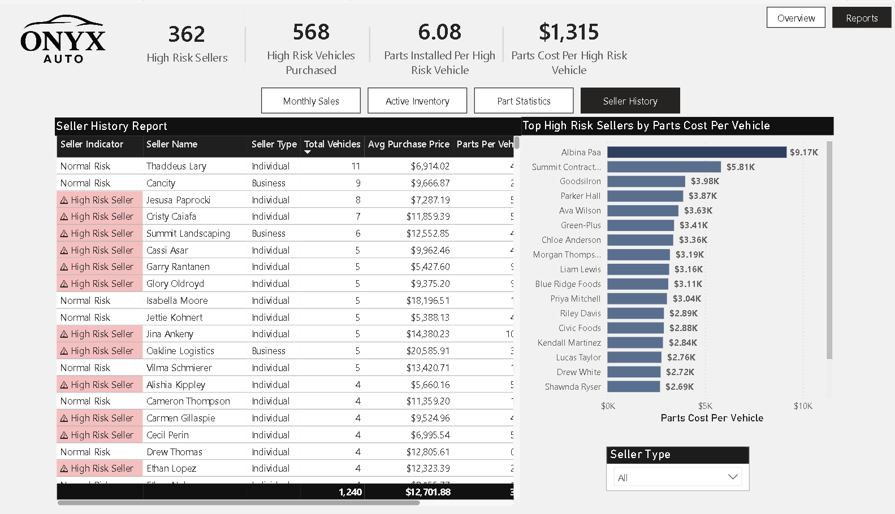

**Figure 10:** Seller history report showing high-risk sellers, high-risk vehicles purchased, parts installed per high-risk vehicle, parts cost per high-risk vehicle, and seller-level risk indicators.

---

## Airflow Orchestration

Apache Airflow orchestrates the daily Onyx Auto pipeline. The DAG is named:

```text
onyx_auto_pipeline
```

The DAG runs daily at 3:00 AM and coordinates the workflow from ingestion through reporting refresh. The DAG is designed to:

1. Trigger the Airbyte MySQL-to-Snowflake sync.
2. Wait for the Airbyte sync to complete.
3. Run the dbt transformation project from the Airflow environment.
4. Refresh the Power BI semantic model.
5. Send a Microsoft Teams alert if a pipeline task fails.

The DAG uses Airflow Variables to manage runtime configuration values such as Airbyte credentials, Power BI API settings, and the Teams webhook URL. This keeps sensitive runtime values out of the DAG code.

### Airflow Screenshots

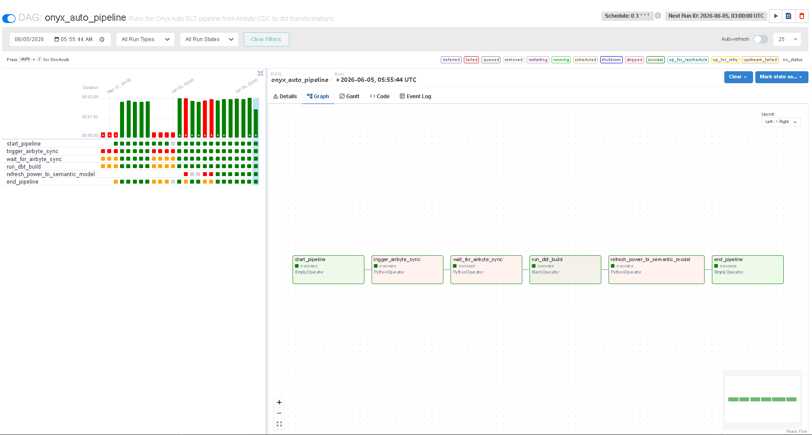

**Figure 11:** Airflow DAG graph showing the scheduled pipeline task sequence.

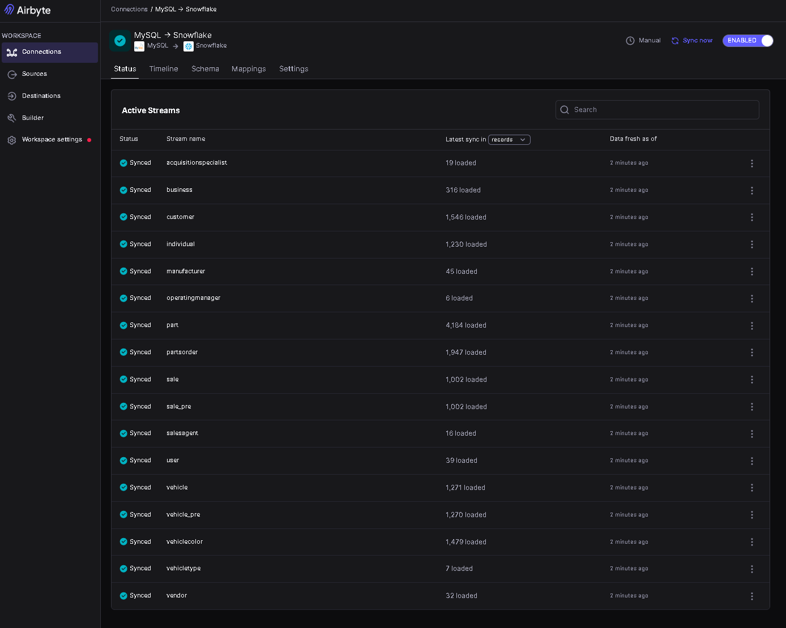

**Figure 12:** Airflow status view showing pipeline execution monitoring.

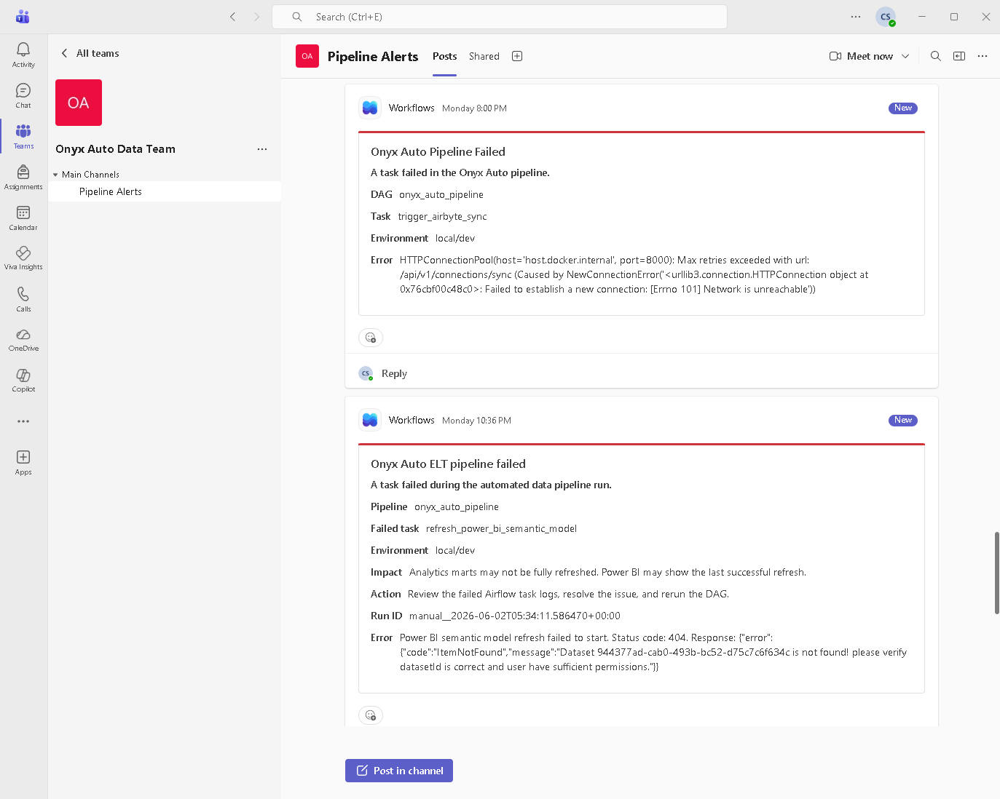

**Figure 13:** Microsoft Teams failure alert generated from the Airflow pipeline failure callback.

---

## Dockerized Airflow Runtime

Airflow is run locally through Docker Compose as a multi-container orchestration environment. The setup includes PostgreSQL for Airflow metadata, Redis for Celery task brokering, and separate Airflow services for the webserver, scheduler, worker, triggerer, initialization, and command-line access.

The environment uses the CeleryExecutor, which allows scheduled pipeline tasks to be executed by Airflow worker containers. Local project folders for DAGs, logs, configuration, plugins, and dbt assets are mounted into the Airflow containers.

The dbt project is mounted under:

```text
/opt/airflow/dbt
```

This allows the Airflow DAG to execute dbt commands as part of the scheduled pipeline.

> **Development note:** This Docker Compose setup is intended for local development and portfolio demonstration. Production deployments would require hardened credentials, externalized secrets, and environment-specific infrastructure configuration.

---

## Repository Structure

```text
onyx-auto-analytics/
├── airbyte/
│   ├── airbyte_schema.PNG
│   └── airbyte_snowflake_settings.PNG
├── airflow/
│   └── dags/
│       └── onyx_auto_pipeline.py
├── app/
│   └── php-frontend/
│       ├── add_part.php
│       ├── add_vehicle.php
│       ├── db.php
│       ├── drilldown.php
│       ├── header.php
│       ├── index.php
│       ├── login.php
│       ├── logout.php
│       ├── reports.php
│       ├── search.php
│       ├── sell_vehicle.php
│       ├── update_part.php
│       ├── vehicle_detail.php
│       └── screenshots/
├── database/
│   ├── data.sql
│   └── relational_schema.sql
├── dbt/
│   ├── screenshots/
│   └── dealership_analytics.zip
├── docs/
│   ├── architecture/
│   │   └── architecture_diagram.png
│   ├── database-design/
│   │   ├── eer_diagram.pdf
│   │   └── relational_schema.sql
│   └── screenshots/
├── powerbi/
│   ├── screenshots/
│   ├── Onyx Auto Dealership Operations Dashboard.pbix
│   └── powerbi-dashboard-web-link.txt
├── snowflake/
│   ├── screenshots/
│   └── snowflake_setup.sql
└── README.md
```

---

## Setup Notes

This repository is intended as a portfolio demonstration of an end-to-end analytics engineering workflow. Running the full project requires local and cloud configuration across PHP, MySQL, Airbyte, Snowflake, dbt, Power BI, Airflow, and Docker.

### High-Level Setup Flow

1. Create the MySQL dealership database using `database/relational_schema.sql`.
2. Load sample dealership data using `database/data.sql`.
3. Configure the PHP frontend to connect to the MySQL database.
4. Configure Airbyte with MySQL as the source and Snowflake as the destination.
5. Run the Snowflake setup script using placeholder credentials.
6. Configure dbt with the Snowflake profile for the `dealership_data` project.
7. Start the Airflow Docker Compose environment.
8. Configure required Airflow Variables for Airbyte, Power BI, and Teams alerting.
9. Enable and trigger the `onyx_auto_pipeline` DAG.
10. Open the Power BI report and refresh the semantic model after the mart tables are built.

### Required Configuration Values

The following values should be managed outside version control:

```text
AIRBYTE_USERNAME
AIRBYTE_PASSWORD
TEAMS_WEBHOOK_URL
POWER_BI_TENANT_ID
POWER_BI_CLIENT_ID
POWER_BI_CLIENT_SECRET
POWER_BI_WORKSPACE_ID
POWER_BI_DATASET_ID
SNOWFLAKE_ACCOUNT
SNOWFLAKE_USER
SNOWFLAKE_PASSWORD
SNOWFLAKE_ROLE
SNOWFLAKE_WAREHOUSE
SNOWFLAKE_DATABASE
SNOWFLAKE_SCHEMA
```

---

## Security and Credential Handling

This project uses several tools that require credentials, including Snowflake, Airbyte, Power BI, and Microsoft Teams. Public repositories should never expose real passwords, tokens, account identifiers, webhook URLs, private keys, or connection strings.

Recommended public repository practices:

- Replace real credentials with placeholders.
- Use `.env.example` files instead of committing real `.env` files.
- Store Airflow runtime values in Airflow Variables or a secrets backend.
- Keep Power BI and Snowflake secrets outside version control.
- Review screenshots to ensure passwords, tokens, and private identifiers are hidden.

---

## Key Skills Demonstrated

This project demonstrates practical analytics engineering and data engineering skills across the modern data stack:

- Transactional database design in MySQL
- PHP application integration with an operational database
- Source-to-warehouse ingestion with Airbyte
- Incremental sync design using append-and-deduplicate patterns
- Snowflake warehouse organization with raw and analytics schemas
- Role-based separation between ingestion and transformation users
- dbt layered modeling with staging, intermediate, and mart models
- dbt tests for important identifiers and model relationships
- Dimensional modeling with facts, dimensions, and aggregates
- Power BI dashboard design and semantic reporting
- Airflow orchestration with scheduled dependency-aware workflows
- Power BI semantic model refresh through orchestration
- Microsoft Teams failure alerting
- Dockerized local orchestration environment
- Repository organization and project documentation

---

## Project Summary

Onyx Auto demonstrates how a used car dealership can move from operational data capture to automated analytics reporting. The project begins with a PHP and MySQL transactional application, moves data into Snowflake through Airbyte, transforms it with dbt into reporting-ready marts, visualizes it in Power BI, and automates the workflow with Airflow running in Docker.

The result is a complete analytics engineering portfolio project that shows how operational data can be modeled, governed, refreshed, and delivered for business reporting.
